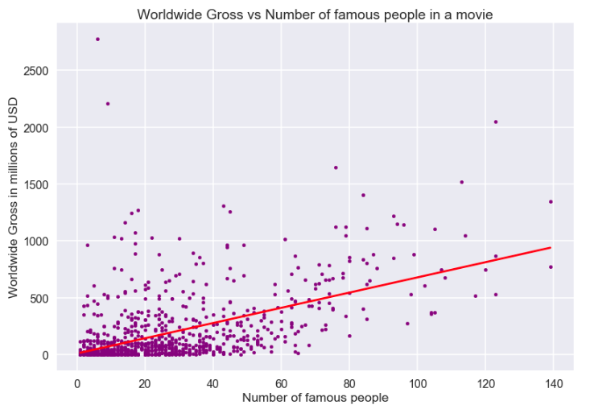
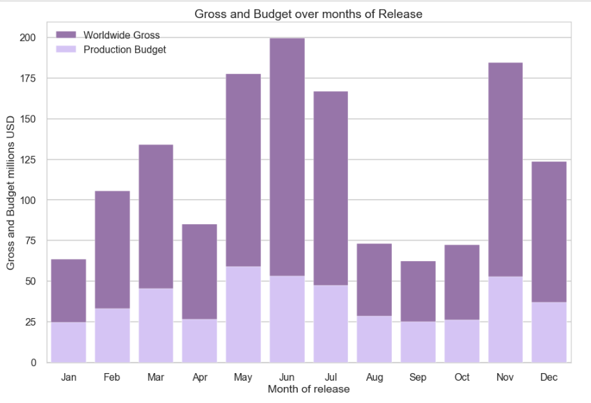

# Title

**Author**: Maria Kuzmin
## Overview

The goal of this study is to better understand how Microsoft can enter into the movie industry with maximum potential to succeed in profitability based on real world data.
The data is sourced from five major websites that give relevant monetary and release information concerning thousands of movies.
The data demonstrates that five specific genres are more profitable.
Also, the data showed that specific months of the year to release the movies is critical.

## Business Problem

To enter into the movie industry, Microsoft would need to have a clear path of entry that takes into account a series of factors based on the evidence of previous movies that proved to be successful and profitable. After researching about the most profitable movies, it became clear that certain genres tend to be more profitable than others, and therefore it was key to investigate if this was true or not based on real data. The key questions that need to be answered to effectively have a business plan are:

- What movie genres have the highest gross income?
- Which ones have the lowest budgets?
- Which movies provide the highest retun on investment?

And once the top genres are clear:
- What makes a movie profitable?
- What are the parameters that we can choose to try to increase our ROI?

And finally: 
- How much can Microsoft expect to produce as an income on average, and how much would it need to invest in the production budget per movie on average?

## Data

The data that was provided for this study consists of some tabular files (csv and tsv formats) that were taken by a few websites. Most of them have informations about the movie budget, gross income (domestic and worldwide), number of reviews and average reviews, movie genre and so on.
Another set of data we have is contained in a database (format SQL) that we can extract information from.
Beside the basic information that also the other websites provide, this database contains also the names of directors and writers for the movies, and a list of the people that each movie is known for.

Preparing the data was key prior to reaching any conclusions. 
First, I had to convert the type of some of the data, that represented numbers but was in the format of strings. 

Second, in order to identify the genre of the movies I had to split the string that describes the genre and convert that into a list, to be able to use the .explode() method to separate the movies that have multiple genres.

Third, I deleted the missing values that were present since there were only a few movies without a genre and compared to the number of entries I have the NaN values seemed negligible.

Fourth, I decided not to remove the outliers yet, since there is something that we can learn from the movie with the highest income or lowest budget.

However, I did decide to remove them for the last step of the analysis, when calculating the averages of budget and gross.

## Methods

With the DataFrame of movies divided by genre I grouped the movies by genre and calculated the average of the numerical values per genre.

In this way I was able to study what on average is the gross income (both worldwide and domestic) per genre. This also allowed me to see what is the budget per genre and some other similar calculations.

Then I selected what I found to be the five genres with highest gross income and highest ROI.

Starting from these five genres, I calculated how many people each movie was known for, and calculated to see if there is a correlation between the number of famous people in a movie and the gross income and production budget.

I also divided the movies by release date to study which are the release months that tend to have the highest gross.

Finally going back to the main database I calculated what is the gross income and budget on average, both considering only movies from the five top genres, and all the movies from all the other genres.

## Results

ROI, return on investment, is a performance measure to evaluate the efficiency or profitability of an investment. It is calculated as net income versus investment and it's expressed at a percentage. This is the most relevant of the figures since it keeps into account the budget and it is normalized so it can give us a more objective idea of how much a movie or a genre is actually profitable, all things considered. Let us calculate it:

Here is an example of how to embed images from your sub-folder:

### Visual 1


Looking at this result I have decided to combine Musical and Music as a genre because of their similarities and also because there might have been some imprecision in which the movie genres were assigned, since their figures are so similar. I also made this choice to include in our study the Adventure genre, which I think is a very valuable one for Microsoft, as I will explain later.

So all this said: We discovered that the top five genres with higest return on investment are Musical, Animation, Horror, Sci-Fi and Adventure.

Now let's calculate the ROI for the top 5 genres and for all the other genres together.

ROI for the top 5 genres is: 278.874 
ROI for the rest of the genres is: 170.308
This is a remarkable result, as the return on investment in the genres that we identified is 1.6 times higher than for the other genres!

### What makes a movie more profitable?
First, I considered the number of people that a movie is known for to see if there is any correlation with the movie gross income.

### Visual 2

It looks like there is a positive correlation between number of famous people in a movie and worldwide gross income.
I calculated it to be able to quantify:

Correlation:  0.5306527988979541
The correlation is a normalized value which means that it spans between 1 and 0.
A 0.5 correlation is considered a moderate positive one.

When to release?
One more element that was worthy of investigation and to be taken into account in trying to produce the most profitable movies is the best time of the year to release a movie.

### Visual 3


The data demonstrated the seasons in which the profit is the highest are the summer and the fall. In particular the months in which the gross income is highest are June and November. This trend is also related to the budgets, as we can observe lower budget movies are usually being released during the less profitable months. It is logical to wait for the most profitable months to release a high budget blockbuster movie, instead of risking a lower return by releasing it during months in which people don't seem to go to the movies as much.


## Conclusions
The study on genre revealed five genres that are roughly twice as profitable as the rest of the genres.
Microsoft should focus on specific genres (Musical, Animation, Horror, Sci-Fi and Adventure) to achieve highest profitability.
Microsoft should also take into consideration what it already is familiar with - the video game industry. Among these genres, animation, adventure and science fiction can be perfect candidates for Microsoft to create video games based on the movies.
When a higher budget is available, Microsoft should consider investing it in having famous writers, directors and actors in their movies, as this tends to increase the gross.
In deciding when to release a movie, the higher budget movies should be released in the summer and fall months, in particular July and November.
### For future consideration:
To deepen this proposal it would be critical to also study marketing as part of the budget, to have a more precise sense of the profit of the movies. Taking into consideration the impact that the internet and cell phones have had on marketing, exposure to movies has radically changed in the past 10-20 years and should be taken into account.
Inflation is another factor that should be considered when calculating and comparing monetary values over different years and decades.
A further inquiry into the months for movie releases separated by genre could also be helpful to decide more specifically when to release which movie.
Separating data according to smaller intervals is also key as genres of movies could be changing in popularity as compared to several years ago (for example, the dominance of superhero movies).

## For More Information

Please review our full analysis in [our Jupyter Notebook](./A Genre Study.ipynb) or our [presentation](./DS_Project_Presentation.pdf).

For any additional questions, please contact **name & email, name & email**

## Repository Structure

Describe the structure of your repository and its contents, for example:

```
├── README.md                           <- The top-level README for reviewers of this project
├── dsc-phase1-project-template.ipynb   <- Narrative documentation of analysis in Jupyter notebook
├── DS_Project_Presentation.pdf         <- PDF version of project presentation
├── data                                <- Both sourced externally and generated from code
└── images                              <- Both sourced externally and generated from code
```